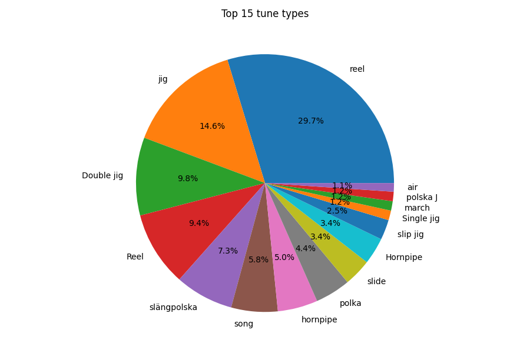
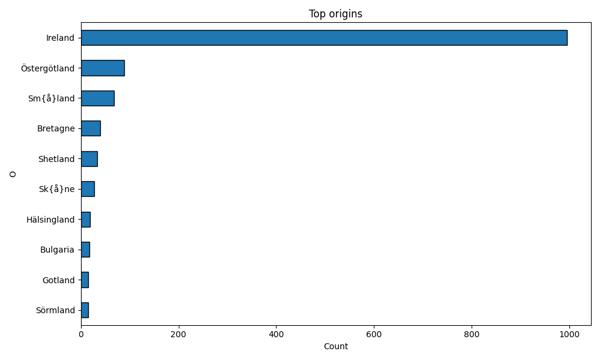

# Data Centric Programming Assignment 2025

- [Assignment Brief](assignment.md)

Name: Jack Shanahan

Student Number: C24775089

# Screenshots
 
  
  

# Description of the project

This project is a Python application that parses ABC music notation files, stores the tunes in a MySQL database, and provides a user interface for querying and analyzing the data. The program reads multiple ABC files from folders representing different books, decodes special characters, inserts the data into a table called `tunes1`, and allows the user to explore the tunes through a Tkinter-based GUI. Additional features include pie charts for tune types and bar charts for origin counts.

# Instructions for use

1. Ensure MySQL is installed and running on your machine.
2. Create a database named `tunes`.
3. Place the `abc_books` folder in the same directory as `main.py`.
4. Run `main.py` to automatically set up the table, parse the ABC files, and launch the GUI.
5. Use the GUI buttons to:
    - Show all tunes
    - Search by title
    - Search by book number
    - View charts for tune types and origins
6. Close the GUI when finished.

# How it works:

- The program recursively scans the `abc_books` directory and reads all `.abc` files.
- Each file is parsed line by line to extract tune metadata.
- Special ABC encodings (like accents) are converted to Unicode.
- Each tune is inserted into the `tunes1` table in the `tunes` database.
- The Tkinter GUI allows users to query the database and view results in a table format.
- Matplotlib generates charts to visualize tune types and origins.

# List of files in the project

| Files | Source |
|-----------|-----------|
| assignment_code.py | Self written |
| abc_books/ | Provided dataset |
| images/ | Screenshots generated from running the application |

# References
* [MySQL Connector for Python](https://dev.mysql.com/doc/connector-python/en/)
* [Tkinter Documentation](https://docs.python.org/3/library/tkinter.html)
* [Matplotlib Documentation](https://matplotlib.org/stable/contents.html)

# What I am most proud of in the assignment

I am most proud of implementing a fully functional GUI that interacts with a MySQL database and allows the user to search, filter, and visualize the tune data. The encoding decoding system ensures all ABC special characters display correctly.

# What I learned

I learned how to parse structured text files into Python dictionaries, interact with a MySQL database using Python, and design an interactive GUI using Tkinter. I also gained experience generating charts in Matplotlib and managing a project with proper version control.
